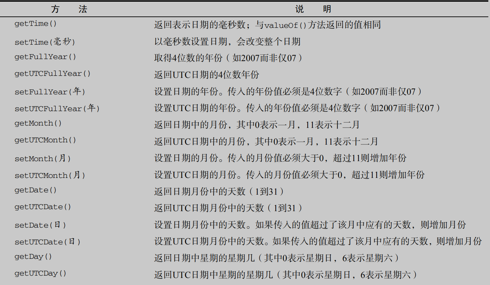
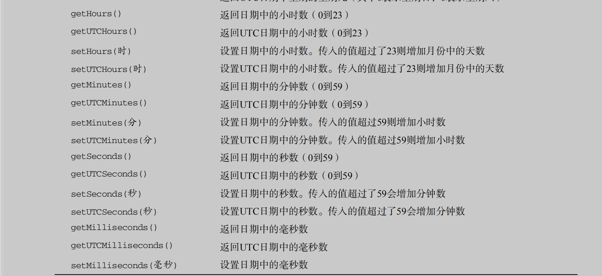

#Chapter4：变量作用域和内存问题
##4.1 基本类型的变量和引用类型的变量的区别；
基本类型的变量（number,boolean,string,null,undefined）,其变量包含的就是这些基本类型值本身，复制该型变量其实就是复制值的副本给另一个变量，两个变量之间毫无关系
而引用类型的变量（对象，Object,function等），变量名包含的是一个指针（引用），指向了对应的对象，在访问引用类型的变量时，实际上访问的是对象的引用。但是复制引用类型的变量其实复制的是该变量的引用（指针），两个变量将指向同一个对象,互相影响;
>基本类型值在内存中占据固定大小的空间，因此被保存在栈内存中,引用类型的值是对象，保存在堆内存中；
>
###4.1.1<font color = "red">函数中的参数为何是按值传递的？？</font>
请看下面的例子：
``` javascript
    function setName(obj) {
        obj.name = "Nicholas";
        obj = new Object();// obj指向了新的对象
        obj.name = "Greg";
    }
    var person = new Object();
    setName(person);
    alert(person.name); //"Nicholas"
    /*
        为什么是“nocholas”，而不是“greg”？？
        在执行完14行代码后，参数（实际上是参数person，和外部的变量person不一样）的指向发生了变化，属性name也变成了Greg，但是当访问person.name的时候依然是“Nicholas”,这说明参数person的指向发生了变化，并不影响外部person的指向，也就是说参数按值传递的(假设是按引用传递的，那么参数person和外部的person指向的的同一个对象，参数person的引用发生了变化，那么外部的person也会发生变化，但实际上并不是)

    */
```
##4.2作用域
###4.2.1.什么是作用域？
就是一套规则，一个根据名称来查找变量的规则。
###4.2.2.规则具体是什么？
引擎会首先在变量所在的作用域中查找（当前作用域），如果没找到，则继续往外层作用域中查找，以此以此类推...,直到找到该变量或者到最外层的作用域为止（全局作用域）
### 4.2.3词法作用域
####1.什么是词法作用域？
就是你在<font color = red>写代码的时候将变量和块作用域写在哪里决定的</font>(也就是说词法作用域只跟变量或作用域的定义的位置有关)，如:
``` javascript
    function foo(a) {
        var b = a + 5;
        function bar(c) {
            console.log(a,b,c);
        }
        bar(4)
    }
    foo(6);
    // 这里面有三个作用域，分别是：
    /**
     * 1.全局作用域，里面只有一个标识符foo,因为包含foo的直接作用域就是全局作用域
     * 2.函数foo所创建的作用域，包含a，b，bar，同理
     * 3.函数bar所创建的作用域，包含c，同理，虽然里面有a,b;但是这两个字符是都定义在了foo形成的作用域中，所以...
     */
```
>注意：`eval（“代码字符串”）`，会改变`eval`所在的环境的词法作用域，因为在写`eval（“代码字符串”）`的地方，会生成“代码字符串”，就好像其本身就存在那里一样.还有一种是`with`语法（不再赘述）,因为使用他们会导致性能的减弱（一般情况下，引擎在词法阶段会去确定好各个变量的位置，以及如何访问它们，`eval`和`with`的出现使的引擎确定不了这些，所以就干脆就不确定和优化），所及尽可能的不要使用他们！
####2、函数作用域
属于这个函数的全部变量都可以在整个函数范围内被访问到和复用（事实上在函数嵌套的作用域上也可以使用）。
``` javascript
    function getSum(params) {
        function as(num){
            return num*2+params
            // 在这里的params可不是属于as的变量,而是属于函数getSum的作用域中的变量（因为在那里定义的），只是在这里进行了访问而已
        }
        var s = as(params);
        console.log(s*2)
    }
    getSum(10);//60
    // 全局作用域中的变量：getSum；
    // getSum函数作用域中的变量：as，parames，s，
    //as函数作用域变量：num
```
>注意：
>1.在访问这样的变量--`a.b.c`的时候,过程是这样的，首先会找到a对象，然后再在a对象的基础上找b,然后找c...以此类推；
>2.<font color = red>在分析函数代码的时候首先要分析并务必弄清楚这个函数的作用域,以及在该作用域下有哪些变量？这些变量他们是如何传递的？</font>
><font color = blue>如何区分函数表达式还是函数声明？</font>就看function 关键字出现在声明中的位置（不仅仅是一行代码， 而是整个声明中的位置）。 如果 function 是声明中的第一个词， 那么就是一个函数声明， 否则就是一个函数表达式。,另外函数表达式是可以匿名的（也就是说匿名函数就是一个函数表达式），但是函数声明不行。
###4.2.4、自运行函数;
####1自运行函数的好处;
    自运行函数能够形成一个独立的作用域，而且不污染其所在的作用域
####2自运行函数的实践和最佳实践
``` javascript
    var name = "李四";
    (function alert1(name,global){
        console.log(name);//张三
        console.log(global.name)//李四
    })("张三",window)
    // 该函数表达式的名字alert1只能在函数体内访问到，这种模式也叫IIFE(立即执行函数表达式)
    // 第一个（）是将函数声明转化为函数表达式，第二个（）是表示立即执行，并且装实参的
```
如果自运行函数的参数是一个函数呢？
``` javascript
    var a = 2;
    (function IIFE(func) {
        func( window );
    })(function def( global ) {
        var a = 3;
        console.log( a ); // 3
        console.log( global.a ); // 2
    })
    // 这里将一个函数def，作为一个自运行函数的参数传递了进去，由于函数是一个对象，函数名其实是个指针，指向函数对象本身，那么在这里def就代表函数,在自运行函数内部调用了这个函数def
```
###4.2.5 块级作用域
简单的了解了一下，总结出了一点，<font color = "red">块级作用域内的变量无论如何是不能被外界访问的到的，</font>这样就避免了污染外部作用域，比如在if语句中用let声明一个变量，无论条件是真是假，都无法访问该变量；
``` javascript
    if(true){
        let a = 12;
        var b = 13;
    }
    console.log(b);//能访问的到,13
    console.log(a)//not defined
```
###4.2.6、声明提升
包括变量和函数在内的所有声明都会在任何代码被执行前首先被处理（被提升到了最前面）,<font color = "red">通常是函数声明提升到了最前面，其次是变量声明</font>。看一个例子：
``` javascript
    foo(); // "b"
    var a = true;
    if (a) {
    function foo() { console.log("a"); }
    }
    else {
    function foo() { console.log("b"); }

```
其实这里有一个函数声明和变量声明提升的过程,上面的代码执行过程是：
``` javascript
    if (a) {
        function foo() { console.log("a"); }
    }
    else {
        function foo() { console.log("b");
    }
    var a;
    //上面的代码执行完后，确定a是一个udefined，所以执行false语句；
    foo(); // 由于此时a是一个undefined，所以在判断语句中执行的额是else语句，所以结果是"b"
    a = true;
    foo();//"b"，此时早已经判断过了，foo的声明也已成定局，所以是"b";
```
###4.2.7 javaScript的垃圾收集机制
1. *标记清除*是目前主要的垃圾收集算法，其思想是给那些不再使用的值加上标记，然后再回收其内存；另一种是“引用计数”，这种算法的思想是跟踪记录所有值被引用的次数，对于引用次数为0的变量进行内存回收
<hr>
#Chapter5：引用类型

##5.1 obj类型
###5.1.1 对象的定义
对象是某种特定引用类型的实例，描述的是一类对象所具有的属性和方法
##5.1.2 创建对象的两种方式
+ 构造函数：`new Array()`,`new Object()`等；
+ 字面量的形式：`[]`,`{}`等
##5.1.3访问对象的属性（或方法）
+ 点"·"表示法(不再赘述)；
+ 方括号表示法
 就是将属性名的字符串形式放在方括号中来进行访问，例如`student["name"]`,
> 方括号表示法的好处之一是可以通过变量的形式访问对象的属性
##5.2 数组
###5.2.1创建数组的方式
1. 构造函数`new Array(param)`方法，参数param可有可无，如果param是一个数字，表示其创建素组的长度；如果是其他（比如是字符串和对象），那么就会创建一个`length`为1的数组,其对应项就是param
2. 字面量 `var arr = []`方法
###5.2.2 数组中的length
数组中的`length`属性不是只读的，你可以给数组设置`length`属性，来达到一定的目的，例如：
``` javascript
    let colorArr = ['red','yellow','green'];
    colorArr.length = 100;
    // 此时当访问colorArr的length的时候，值是100，只不过从第四项开始一直到最后一项都是undefined
```
###5.2.3 检测一个对象是否是数组
`Array.isArray(value)`,这里的value就是要检测的对象或数组，返回`true`或者`false`;
###5.2.4 数组中常用的一些方法
1. `push()和pop()`：其中`push()`方法接受任意数量的参数，以将其逐个添加到数组的末尾，并返回修改后数组的length（也就是说操作的结果是一个数字）;而`pop()`则是从数组的末尾移除最后一项，并返回移除的项；
``` javascript
    // push()
    let arr = [1,2,3];
    console.log(arr.push('4','7','22'));// 6；
    console.log(arr);// [ 1, 2, 3, '4', '7', '22' ]
    // pop()
    console.log(arr.pop());//‘22’
```
2. `unshift()和shift()`：这里`unshift()`方法和`push()`方法类似,也接受任意数量的参数，只不过会将参数逐个添加到数组的顶部，并返回修改后数组的长度；`shift()`方法和`pop()`方法类似，移除数组的第一项并返回之
3. `concat(param)`方法：首先会复制一份原数组的副本，参数`param`如果是一个（或多个）数组，结果会将数组中的每一项的依次拼接到原数组后面，并返回之；如果`param`不是数组，那么就会将`param`直接拼接到原数组后面并返回之
4. `slice()方法`：会基于当前数组中的一项或者多项，返回新创建的新的数组。接受一个或者两个参数，即返回项的起始和结束位置（如果是两个参数，返回的是不包括结束位置项）
``` javascript
    let person = ['hello','world','biadu','pingk'];
    console.log(person.slice(1,2));// world
    console.log(person.slice(1)); // [ 'world', 'biadu', 'pingk' ]
    console.log(person.slice());// 返回原数组
```
>如果参数中有负数，那么就加上原数组的length，再进行分析

5. `splice()方法`：功能非常强大
    + *删除*：传递两个参数，即要删除项的起始位置和要删除的项数；
    + *插入*：传递三个参数,即要删除项的起始位置，0，和要插入的项（如果有多项要插入，就接着传）；
    + *替换*：传递三个参数，即要删除项的起始位置，删除的项数和要插入的项（如果有多项，就接着传，其中删除项的起始位置也就是插入项的起始位置）；
    > 该方法返回的结果是由返回的项组成的数组，操作元素组；
``` javascript
        let personAee = ['Tom','Jerry','Herry','perter','Sans','Cary'];
        let los = personAee;
        console.log(personAee.splice(2, 3, 'John', 'Smith'));// 'Herry','perter','Sans'
        console.log(personAee);// 'Tom','Jerry','John','Smith','Cary'
        console.log(los);// 'Tom','Jerry','John','Smith','Cary',因为两个变量之乡的是同一个数组，当一个变化的时候两一个也会被影响到
        console.log(los.splice(1, 0, 'Herry', 'Jundle'));// 'Tom', 'Herry', 'Jundle', 'Jerry', 'John', 'Smith', 'Cary'
```
`indexOf()和lastIndexOf()方法：` 两个可以接受两个参数，要查找的项和查找起点位置的索引;两个唯一的区别是查找的方向不同：前者是由前往后查找，后者是由后向前查找，都返回查找项在数组中的位置，如果没有查找到就返回-1
`迭代方法：`非常多，包括`map()`,`every()`,`filter()`,`each()`等不再详细赘述
``;
###5.2.5 数组的重排序
`arr.reverse()`是反转数组，`arr.sort()`方法会对数组进行重排序,但问题是`sort()`方法排序实际上先将数组中的某一项调用`toString()`方法转化为字符串后再进行排序，这样肯定不行。
sort()方法一般要接受一个比较函数作为参数：
``` javascript
    var arr1 = [1, 4, 3, 6, 9, 2];
    function sortBy(pa1,pa2) {
        if (pa1>pa2){
            return 1;
        }else if(pa1<pa2){
            return -1;
        }else if (pa1 === pa2) {
            return 0;
        }
    }
    console.log(arr1.sort(sortBy));//一个拍过序的数组，从小到大
```
> reverse()和 sort()方法的返回值是经过排序之后的数组
##5.3 Date类型
###5.3.1 简介
日期对象，创建该对象的方式为 `var date = new Date()`构造函数可以传参，如一定格式表示日期的字符串，表示日期 的毫秒数
###5.3.2 常用的方法：
+ `Date.now()`:返回调用该方法时的毫秒数
>注意：使用`+new Date()`可以将日期对象转化为表示当前时间的毫秒数，效果和`Date.now()`一样
###5.3.3 Date对象的一些方法


>这些方法是Date对象的方法，所以在调用的时候在这些方法前面加上实例Date对象实例，例如`date.getFullYear（）`
##5.4 正则表达式
###5.4.1 正则表达式的写法；
1. 字面量语法
`var expression = / pattern / flags` ;其中`flags`可以是：
`g`:全局匹配，不止匹配一次(即匹配到一次后还会继续匹配,下一次匹配是在上一次匹配到的字符的下个字符开始匹配)；
``` javascript
    let reg4 = /.bo/g;
    let str4 = 'abobobobob';  //只会匹配两次，第一次匹配到’abo‘（0-2），第二次匹配到’obo‘；
    // 第一次匹配到abo，第二次是从第四个字符开始匹配
```
`i`:在匹配的时候不区分大小写；
`m`:可以换行匹配；
三个的任意组合；

2. 构造函数语法：
`var reg = new RegExp('pattern',[flags])`，两个参数，一个是字面量模式中pattern的字符串模式，另一个是flag的字符串形式
``` javascript
    var reg = /[sbs]er/ig;
    var reg =  new RegExp('[sbs]er','ig');
    // 两个一样
```
> 对于字面量中的转译字符`\`，在构造函数中会要写成`\\`即可，其他不用管

###5.4.2 正则表达式中的元字符；
`( [ { \ ^ $ | ) ? * + .]}`，所谓的元字符，就是这些字符在一般情况下是作为规则的一部分不参与匹配，
但如果想要匹配这些元字符，就需要使用`\`对这些元字符转译；其中元字符`^`和`$`分别匹配字符串的开始和结尾；
###5.4.3 正则表达式的一些方法；
1. `reg.exec()`:里面传一个参数即要匹配的字符串；
如果能匹配的到，就返回一个数组，数组的第一项表示与整个模式匹配的字符串，第二项是与模式中捕获组匹配的字符串（如果没有捕获组，那么该数组就只有一项），与此同时，该数组有两个属性：`input`表示应用正则表达式的字符串，`index`表示匹配项在字符串中的位置。
``` javascript
    var text = "mom and dad and baby";
    var pattern = /mom( and dad( and baby)?)?/gi;
    var matches = pattern.exec(text);
    alert(matches.index); // 0
    alert(matches.input); // "mom and dad and baby"
    alert(matches[0]); // "mom and dad and baby"
    alert(matches[1]); // " and dad and baby"
    alert(matches[2]); // " and baby"
```
<font color = red>如果正则表达式是全局匹配`g`，那么每次调用该方法，都会在原来的基础上查找新的匹配项;如果不是全局匹配，那么每次执行该方法都会从最初的起始位置开始搜索</font>
``` javascript
    let text = 'cat, bat, sat, fat';
    let pattern1 = /.at/g;

    let maches = pattern1.exec(text);
    console.log(maches[0]);// cat
    console.log(maches.index);// 0 因为是第一次执行该方法，所以是0
    console.log(maches.input);// 'cat, bat, sat, fat'   应用该正则表达式的字符串
    console.log(maches.lastIndex);// 3 表示开始搜索下一个匹配项的起始位置，因为下一次搜索匹配项的开始位置是3
    maches = pattern1.exec(text);
    console.log(maches[0]);// bat
    console.log(maches.index);// 5 因为是第二次执行该方法，所以是5
    console.log(maches.input);// 'cat, bat, sat, fat'   应用该正则表达式的字符串
    console.log(maches.lastIndex);// 8 表示开始搜索下一个匹配项的起始位置；同理

```
如果没有匹配的到，就返回null；
2. `reg.test(str)`方法：如果至少匹配到一次，就返回`true`,否则就返回`false`;常用于判断表单中的输入是否合乎规则；
##5.5 函数Function
###5.5.1 函数的定义和理解
函数是一个对象(new Function())，那么函数名其实就是一个指向该函数的指针；
###5.5.2 函数声明和函数表达式；
两者最大的却别在于：函数声明有一个‘函数声明提升’的过程，也就是说可以在函数声明前调用该函数，
但是函数表达式没有该过程，代码只能按顺序执行;
``` javascript
    // 为什么该函数会在函数声明之前调用？这是因为函数声明有一个函数声明提升的过程，
    // 虽然是声明函数在后，但引擎在解析的时候，会把函数声明代码提升到最顶部，所以还是相当于先执行了函数声明的代码
    console.warn(reduce1(21));//10
    function reduce1 (params) {
        return params - 11;
    }
    // 函数表达式没有提升，只能是按顺序执行,所以当执行第一段代码的时候，由于找不到该变量reduce2，所以就会报错；
    console.log(reduce2(190));// reduce2 is  not a function
    var reduce2 = function (params) {
        return params - 14;
    };
```
###5.5.3 arguments和this
两者都是函数内部的属性，`arguments`是一个类似数组的一个对象，包含着传入函数中的所有参数，除此之外该对象还有一个属性`callee`,是一个指针，指向拥有该`arguments`对象的函数；
``` javascript
    function getSum(params) {
        console.log(arguments);
        console.log(arguments.callee); // getSum函数本身
        return params + 10;
    }
```
`arguments.callee`但最主要的用途是用在递归中，例如：
``` javascript
    // 递归阶乘
    function Sum(params) {
        if (params > 1) {
            return params * arguments.callee(params - 1);
        }
        else {
            return 1;
        }
    }

    // 递归 求和；
    function Sum2(params) {
        if (params > 0) {
            return  params+arguments.callee(params - 1);
        }else{
            return 1
        }
    }
    console.log(Sum2(12));
```
`this`也是一个指针，指向函数据以执行的环境对象（也就是函数在哪里执行`this`就代表什么对象），也就是`this`的值。
`caller`,函数的另一个属性；是一个指针，指向调用该函数的函数的引用，这里的`该函数`是谁，遵循一条规则---`谁·caller`就是谁,也就是说哪个函数调用了`该函数`，该指针就指向那个函数。
``` javascript
    function acer () {
        get();//很明显是acer函数调用了这个函数
    }

    function get() {
        console.log(get.caller);
    }
    acer();// acer 函数本身；
```
###5.5.4 call和apply；
用途都是在特定的作用域中调用函数，实际上等于设置函数体内 `this` 对象的值（<font color = red>改变函数体内`this`的指向</font>），
``` javascript
    window.color = 'red';
    var o = {color:'blue'};
    function sayColor() {
        console.log(this.color);
    }
    sayColor.call(o);// blue,因为此时sayColor中的this就指向了对象o，所以就是blue；
    sayColor.call(window) // red,同上，sayColor中的this指向了window，所以就是red；
    sayColor.call(this)// this 在全局环境下就是window，所以还是相当于指向了window
```

其中`call`接受俩个参数，一个是在其中运行函数的作用域，一个是参数数组（或者`arguments`）；
`apply`接受多参数，第一个总是运行函数中`this`的指向，后面的就是列举的其他参数（形参）
bind()方法：该方法会创建一个函数的实例，并且该函数的实例中的this指向传递给bind()方法的参数。
``` javascript
    window.color = 'yellow',
    var obj = {
        color: 'pink'
    };

    function sayColor1() {
        console.log(this.color)
    }
    var hhh =  sayColor1.bind(obj);//创建的一个新的函数实例
    hhh();
    // 此时hhh函数中的this就指向obj，所以是pink
```
###5.6 基本包装类型(String，Boolean，Number)
其实在每次在访问基本类型的时候,都会在背后创建一个对应的包装类型对象，从而让我们能过够通过一些方法操作数据（只存在于访问变量的顺瞬间，然后立即销毁）
#### 5.6.1 Number的那些常用的方法;
1. `num.toString(n)`返回`num`的n进制表示的字符串；
2. `num.toFixed(n)`将数字`num`保留位小数，会四舍五入；
3. `num.toPrecision()`返回数字`num`的最佳表现形式；
#### 5.6.2 String类型的方法
1. `str.charAt(index)` 返回字符串`str`中下标是`index`的字符;
2. `str.charCodeAt(index)` 返回字符串`str`中下标是`index`的字符的编码;
3. `str.concat(str1,str2,...)`将一个或者多个字符串拼接到str的后面（其实并不常用，一般用“+”就可以了）；
4. `str.slice(startIndex,[endIndex])` 返回将字符串`str`从`startIndex`处开始裁剪到（如果有）`endIndex`(不包括)结束的子字符串。
5. `str.substring(startIndex,[endIndex])` 同上；
6. `str.substr(startIndex[,length])` 返回将str从`startindex`处开始裁剪，裁剪（如果有）长度为`length`的字符串；
>在传递给这些方法的参数是负值的情况下，它们的行为就不尽相同了。其中，slice()方法会将传入的负值与字符串的长度相加，substr()方法将负的第一个参数加上字符串的长度，而将负的第二个参数转换为 0。最后，substring()方法会把所有负值参数都转换为 0。
7. `indexOf()`和`lastIndexOf()`:传入一个要查找的字符串，如果在str中找到，则返回该字符串的下标，如果没找到则返回-1，两者的不同之处在于前者是正向查找，后者是反向查找。也都可以接受第二个参数表示从哪个下标开始查起。
`trim()`去掉字符串str两边的空格；不操作原字符串
8. `toUpperCase()`和`toLowerCase()` 将字符串str中的字母转化为大（小）写；
9. `str.match(regExp)`接受一个参数`regExp`,其要么是一个正则表达式，要么是一个正则对象；作用和正则的`reg.exec(str)`方法一样,参考之即可；
10. `str.search(regExp)` 接受一个参数，要么是一个正则表达式，要么是一个正则对象；如果在str中匹配到了正表达式，就返回匹配到的下标，否则就返回-1；例如：
``` javascript
    let str3 = 'I am Zhang shuaiFeng';
    let reg = /.an/;
    let regO = new RegExp('.an');
    let regOb = new RegExp('.Ad')
    console.log(str3.search(reg));// 6 匹配到了han
    console.log(str3.search(regO)); // 6;
    console.log(str3.search(regOb)); // -1 因为根本没没匹配到一个；
```
11. `str.replace(param,replacer)`将字符串`str`中匹配到的字符串替换成replacer，第一个参数可以是一个字符串也可以是一个正则表达式或者正则对象，第二个参数是’替换者‘。例如：
``` javascript
    let str4 = 'bat cat mat lat sat';
var reg4 = /.at/;
var reg5 = new RegExp('.at');
var reg6  = /at/g;
// 第一个参数是正则
console.log(str4.replace(reg4, 'ond')); // ond cat mat lat sat，只匹配到一次，‘bat’所以被替换成了‘ond’
console.log(str4.replace(reg5, 'ond'));// 同上；
// 第一个参数是字符串
console.log(str4.replace('at','ond')); // 同上，只匹配一次将第一个at，替换成了ond;
// 全局匹配；
console.log(str4.replace(reg6, 'ond'));// 同上；全局匹配，匹配了多次 bond cond mond lond sond
```
12. `str.split(sym[,Arrleg])`: 将字符串`str`根据分隔符`sym`分割成多个字符串，并将其置于一个数组中；返回之,还可以传入第二个参数来限定返回的数组的长度；例如
``` javascript
    let str5 = str4;
    console.log(str5.split(' ')); // [ 'bat', 'cat', 'mat', 'lat', 'sat' ]
    // 参数`sym`还可以正则表达式
```
###5.7 单体内置对象
`encodeURL(urlStr)`和`encodeURIComponent(urlStr)`:将URL进行编码，两者的区别是前者只会对本身不属于URL的特殊字符进行编码(如空格),而后者则是会对其发现的所有的非标准字符进行编码（包括双斜杠，问号等），其中urlStr是url字符串（深度编码）
####5.7.1 关于eval
`eval()`接受一个参数，要执行的javaScript代码字符串，其运行的时候，就相当于把js代码直接写在那里似的（本来就存在于那里一样）
####5.7.2 关于Math对象的一些方法
1. `max(min)()`:返回一组数据中最大（小）的那个；
2. `ceil()`:向上舍入，总是将数值向上摄入为最接近的整数（比原值大）；
3. `round()`:四舍五入；
4. `floor()`:向下舍入，总是将数值向下舍入为最接近的整数（比原值小）；
5. `random()`:返回一个介于0-1（≥0且小于1）的随机数
>想要取得介于a-b之间的整数可以使用如下代码
```javascript
    var num = Math.floor(Math.random() * (b-a+1)+a);
```
这是因为`()`里面的取值范围是[a,b+1),然后对其向下取整,就是a-b之间的数
###6
